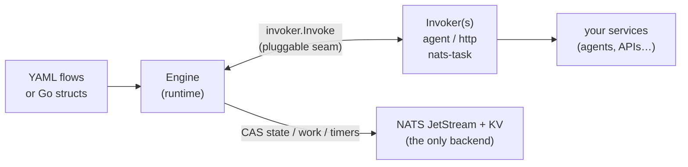

# Packtrail

[](https://github.com/henomis/packtrail/actions/workflows/checks.yml) [](https://godoc.org/github.com/henomis/packtrail) [](https://goreportcard.com/report/github.com/henomis/packtrail) [](https://github.com/henomis/packtrail/releases)

A **durable, ecosystem-agnostic workflow engine** in Go, backed **only by NATS**
(Core + JetStream + KV + Message Scheduler). Packtrail orchestrates declarative
flow graphs — `task`, `fanout`, `fanin`, `choice` and `signal` nodes — defined
either in YAML or directly as Go structs, with crash-durable state, retries,
conditional routing, external signals and timers/cron.

Packtrail's defining feature is that **node execution is pluggable**. The engine
never speaks a wire protocol directly: every `task`/branch node runs through an
[`Invoker`](invoker/invoker.go). A project plugs in its own transport — an
agent caller, an HTTP client, a NATS request/reply worker — and inherits all of
packtrail's durability machinery for free.



## Installation

```sh
go get github.com/henomis/packtrail
```

Requires Go 1.26+ and a running **NATS Server 2.12+** with JetStream enabled
(`nats-server -js`) — packtrail relies on the JetStream **Message Scheduler**
(2.12) for every timer (retry backoff, signal timeouts, cron). Tests embed a
real NATS server — no external server needed to run them.

> **Upgrading across v0.0.x releases:** the on-NATS layout (bucket and stream
> shapes) may change between pre-1.0 versions with no migration tooling. Drain
> in-flight executions before upgrading, or start the new version under a fresh
> namespace.

## Quick start

```go
nc, _ := nats.Connect(nats.DefaultURL)

srv, _ := packtrail.New(nc,
    packtrail.WithFlowsDir("flows"),           // directory of *.yaml flow files
    packtrail.WithNamespace("acme"),           // isolate from other deployments
    packtrail.WithInvoker("agent", myInvoker), // your transport
    packtrail.WithResultCache(),               // idempotent retries
)

// Register an in-process nats-task worker (optional)
srv.Handle(ctx, "tasks.notify.*", notifyHandler)

id, _ := srv.Start(ctx, "agent-pipeline", payload)
srv.Signal(ctx, id, "approval", data)
ex, _ := srv.Get(ctx, id)

srv.Run(ctx) // blocks: engine + indexer + reconcile + archival
```

`New` performs no NATS I/O: it parses and validates the flows, and every bucket
and stream is provisioned lazily by the first call that needs NATS (`Start`,
`Run`, `Get`, …). Call `srv.Init(ctx)` explicitly at startup if you want
provisioning errors (e.g. JetStream disabled, missing permissions) to fail
fast instead of surfacing on first use.

## Built-in transport

Packtrail ships the built-in **`nats-task`** invoker — a `pkg/protocol`
request/reply on `tasks.<x>.*` — as the default transport. So:

- Any task worker that serves the protocol (`protocol.Serve` on `tasks.*`) works
  unchanged — just use the default `subject:` on a node.
- New flows can select any registered invoker per node via `invoker:` + `target:`.
- The core has **no dependency on any agent framework** (enforced by
  `internal/acceptance`), so it stays reusable by any project.

For slow nodes there is also the built-in **`invoker/asyncqueue`** package, which
makes any ordinary Invoker durable and asynchronous — see
[Async activities](#async-activities-long-running-work).

## Flow definition

Flows can be defined in YAML or as Go structs — both paths run through the same
validation and produce identical runtime behaviour.

### YAML

```yaml
version: "1.0"
name: agent-pipeline
nodes:
  - {id: triage, type: task, invoker: agent, target: triage-agent,
     timeout: 2m, retry: {max_attempts: 3, backoff: exponential}}
  - id: route
    type: choice
    rules:
      - {when: 'results.triage.category == "billing"', to: billing-agent}
      - {default: true, to: general-agent}
  - {id: billing-agent, type: task, invoker: agent, target: billing-agent}
  - {id: general-agent, type: task, invoker: agent, target: general-agent}
  - {id: notify, type: task, subject: "tasks.notify.{execution_id}"}  # built-in nats-task
edges:
  - {from: triage, to: route}
  - {from: billing-agent, to: notify}
  - {from: general-agent, to: notify}
```

### Go structs

The same flow as a `FlowDef`, useful when flows are constructed programmatically:

```go
packtrail.WithFlowDef(packtrail.FlowDef{
    Version: "1.0",
    Name: "agent-pipeline",
    Nodes: []packtrail.NodeDef{
        {ID: "triage", Type: "task", Invoker: "agent", Target: "triage-agent",
         Timeout: 2 * time.Minute, Retry: &packtrail.RetryPolicy{MaxAttempts: 3, Backoff: "exponential"}},
        {ID: "route", Type: "choice", Rules: []packtrail.RuleDef{
            {When: `results.triage.category == "billing"`, To: "billing-agent"},
            {Default: true, To: "general-agent"},
        }},
        {ID: "billing-agent", Type: "task", Invoker: "agent", Target: "billing-agent"},
        {ID: "general-agent", Type: "task", Invoker: "agent", Target: "general-agent"},
        {ID: "notify", Type: "task", Subject: "tasks.notify.{execution_id}"},
    },
    Edges: []packtrail.EdgeDef{
        {From: "triage", To: "route"},
        {From: "billing-agent", To: "notify"},
        {From: "general-agent", To: "notify"},
    },
})
```

`WithFlowDef` may be combined freely with `WithFlow` and `WithFlowsDir`; duplicate
flow names across any source are rejected at startup.

Use keyed composite literals for `FlowDef` and `NodeDef`. These structs mirror
the YAML schema and may grow as the schema gains fields (for example `Version`
and choice-node `OnError`).

- `invoker:` / `Invoker` selects a registered Invoker kind (default `nats-task`).
- `target:` / `Target` is interpreted by that Invoker (an agent name, a URL, …);
  `subject:` / `Subject` is the nats-task alias. `{execution_id}` is substituted
  at dispatch.
- `retry.backoff` / `Retry.Backoff` accepts `exponential`, `linear`, or `fixed` (default).
- Flow names, node ids and signal names become NATS subject tokens and KV key
  segments, so they must match `[A-Za-z0-9_-]{1,128}` (the namespace prefix:
  `[A-Za-z0-9_-]{1,64}`); anything else is rejected at load time.
- **YAML is strict.** An unknown field (a typo like `retires:`) is a parse
  error, not a silently dropped setting, and a file may hold exactly one flow
  document (extra `---` documents are rejected, so none is silently ignored).
- **Every `invoker:` kind must be registered.** `New` rejects a flow whose task
  node names a kind that is neither the built-in `nats-task` nor registered via
  `WithInvoker`/`WithAsyncInvoker` — a typo'd kind fails at construction, not on
  the first execution to reach that node. Kind registrations must also be
  unambiguous: the same custom kind registered twice, both sync and async, or an
  async kind shadowing `nats-task`, is a construction error. A sync
  `WithInvoker("nats-task", ...)` intentionally replaces the built-in transport.
- **Every node must be reachable.** A node not connected to the start node by
  any edge, choice rule, fanout branch or `on_timeout` route is rejected — dead
  graph configuration is almost always a typo'd target.
- A `nats-task` subject must be publishable: whitespace or wildcard characters
  (`*`, `>`) are rejected at load; the `{execution_id}` placeholder is legal.

## Node types

### `task`

Invokes an Invoker with the assembled context — `{"input": <start payload>,
"results": {<node>: <output>, …}, "signals": {<name>: <payload>, …}}` — and
stores whatever it returns as this node's output. The most common node type.

```yaml
- id: step
  type: task
  invoker: agent          # registered invoker kind (default: nats-task)
  target: my-agent        # interpreted by the invoker
  timeout: 2m
  retry:
    max_attempts: 3
    backoff: exponential
```

### `choice`

Routes the execution to one of several branches based on boolean expressions
evaluated against the assembled context:

```yaml
- id: route
  type: choice
  rules:
    - {when: 'results.triage.risk_score > 80', to: manual-review}
    - {when: 'input.category == "billing" && results.triage.amount > 1000', to: billing-agent}
    - {default: true, to: general-agent}
```

- **Expression language.** `when` uses [expr-lang](https://expr-lang.org/): comparisons
  (`==`, `!=`, `<`, `>`), boolean logic (`&&`, `||`, `!`), membership (`in`),
  string and arithmetic operators. Compiled once on load — a syntax error is a
  validation error, not a runtime surprise.
- **Bounded evaluation.** Choice rules run as straight-line predicates with an
  explicit VM memory budget. To keep evaluation bounded, validation rejects
  ranges, iteration helpers (`map`, `filter`, `all`, `any`, `sortBy`, …), and
  function calls other than `len(...)`.
- **Variables in scope.** `input` (the start payload), `results` (each visited
  node's output, keyed by node id), `signals` (received signal payloads, keyed
  by signal name), `branches` (the current fan's outputs) and `last_node` (the
  id of the most recently settled output — "the previous step's result" is
  `results[last_node]`). Reach into them with dotted paths:
  `results.triage.risk_score`, `input.user.tier`, `signals.approval.granted`.
- **First match wins.** Rules are evaluated top to bottom. Order from most to least
  specific.
- **`default` is required.** Validation rejects a choice node without a
  `{default: true, to: …}` branch, so a choice can never dead-end.
- **Missing fields fall through.** If a `when` expression errors (e.g. missing
  field), that rule counts as no match and evaluation continues to the next rule.
  Add `on_error: fail` (or `NodeDef.OnError: "fail"`) to fail the execution on an
  evaluation error instead.

### `fanout` / `fanin`

Dispatch multiple branches in parallel and join them back:

```yaml
- id: fan
  type: fanout
  branches: [worker-a, worker-b, worker-c]

- id: join
  type: fanin
  wait_for: [worker-a, worker-b, worker-c]
  join_policy: all          # all | any | quorum:N
```

- `fanout` launches every branch listed in `branches` as a parallel sub-execution.
- `fanin` waits for the branches listed in `wait_for` according to `join_policy`:
  - `all` (default) — advance when every branch completes.
  - `any` — advance when the first branch completes.
  - `quorum:N` — advance when at least N branches complete.
- The fan graph is validated at load: a node may be a branch of at most one
  fanout, every `wait_for` node must be some fanout's branch, and fanout/fanin
  nodes must not lie on a cycle (branch state is per-execution, not per-visit,
  so a revisit would reuse it). Adjacency is checked too: every branch must be
  a `task` node (any other type would never settle), a fanout's single outgoing
  edge must lead to a fanin (that is where the execution parks and the join is
  evaluated), and that fanin may only wait for branches of its own fanout —
  waiting on a subset is fine (join on the critical branches, let the rest
  settle in the background).

### `signal`

Parks the execution until an external signal arrives (or the timeout fires):

```yaml
- id: wait-approval
  type: signal
  signal_name: approval
  timeout: 24h
  on_timeout: escalation    # node to jump to on timeout
```

Send the signal from your application:

```go
srv.Signal(ctx, execID, "approval", json.RawMessage(`{"approved": true}`))
// If the caller may retry after an ambiguous publish result:
srv.SignalWithID(ctx, execID, "approval", "request-123", json.RawMessage(`{"approved": true}`))
```

The signal payload is stored in the data plane — downstream nodes and choice
rules see it as `signals.approval` — and execution resumes at the next node. If `timeout` elapses first, the execution advances to `on_timeout`
instead. An `on_timeout` without a positive `timeout` is rejected at load — the
route could never fire.

Signals are durable and forgiving about ordering: a signal sent before the
execution reaches its signal node is stored and consumed on arrival, and one
sent just before the execution is created is redelivered until the execution
exists. A genuinely orphaned signal (e.g. a typo'd execution id) is
dead-lettered after the delivery cap instead of vanishing silently. Timeouts
are evaluated by the NATS Message Scheduler at roughly one-second granularity,
so sub-second `timeout` values fire at the next tick. Use `SignalWithID` when a
caller needs an idempotency key for ambiguous publish retries; duplicate
publishes with the same key collapse within the signal stream's dedupe window.

## Async activities (long-running work)

An Invoker normally returns a terminal status (`StatusOK`/`Error`/`Retry`) and
the engine settles the node synchronously. For long-running work (an agent call,
a remote job) an Invoker can instead return **`StatusPending`**: the engine parks
the execution as `waiting` and frees its work slot immediately, without blocking.
The activity is settled later via
`Server.CompleteActivityWithGeneration(ctx, execID, node, generation, attempt, result)`
— OK to advance, Error to fail, Retry to re-dispatch per the node policy. Use the
`Generation` from the original `Request`; it fences stale completions from an
earlier legal cycle or `Resume` visit of the same node/attempt. The legacy
`CompleteActivity(ctx, execID, node, attempt, result)` remains available when no
generation is available. Completion is idempotent and robust to a completion that
arrives before the task has finished parking, so an at-least-once worker can call
it freely. This works for plain task nodes and fan-out branches alike.

### The built-in async invoker (recommended)

You rarely need to wire that plumbing by hand. The **`invoker/asyncqueue`**
package turns any *ordinary synchronous* Invoker into a durable asynchronous one:
register it with `WithAsyncInvoker` and packtrail dispatches matching nodes to a
JetStream work-queue (returning `StatusPending` for you), runs your Invoker on an
in-process worker pool off the engine's critical path, and settles the result via
`CompleteActivityWithGeneration` — with bounded queues, at-least-once delivery,
generation-aware dispatch dedup, ack-extending heartbeats and crash redelivery
all handled for you.

```go
// Your slow work is just a normal Invoker — no queue/ack/heartbeat code.
exec := packtrail.InvokerFunc(func(ctx context.Context, req packtrail.Request) (packtrail.Result, error) {
    out, err := callSlowService(ctx, req.Target, req.Payload) // an agent, an API, …
    if err != nil {
        return packtrail.Result{}, err // transient → retried per the node policy
    }
    return packtrail.Result{Status: packtrail.StatusOK, Payload: out}, nil
})

srv, _ := packtrail.New(nc,
    packtrail.WithAsyncInvoker("agent", exec,
        asyncqueue.WithConcurrency(64)), // tune the worker (optional)
    // … plus flows whose nodes select `invoker: agent`
)
```

Each kind gets its own work-queue stream, so many workers — in or out of process —
can share it to scale horizontally; the low-level `asyncqueue.Dispatcher` and
`asyncqueue.Worker` are exported for out-of-process workers.

### Doing it by hand

For a bespoke transport you can implement the two halves yourself: return
`StatusPending` from your Invoker after enqueuing a durable job, and call
`CompleteActivityWithGeneration` from the worker that runs it.

```go
// dispatch (non-blocking): enqueue a durable job, return pending
func (d *dispatcher) Invoke(ctx context.Context, req packtrail.Request) (packtrail.Result, error) {
    enqueueJob(req.ExecutionID, req.NodeID, req.Generation, req.Attempt, req.Payload) // your durable queue
    return packtrail.Result{Status: packtrail.StatusPending}, nil
}

// later, from the worker that ran the job:
srv.CompleteActivityWithGeneration(ctx, execID, node, generation, attempt,
    packtrail.Result{Status: packtrail.StatusOK, Payload: out})
```

## Resuming failed executions

A failed execution can be revived with `Resume`. It re-runs the node it failed
on with a fresh retry budget, preserving the durable state and every stored
output. Any running engine
for the namespace picks up the resumed work.

```go
err := srv.Resume(ctx, execID)
```

## Cron scheduling

Start a flow on a recurring schedule with `ScheduleFlow`. The cron expression is
6-field (`sec min hour dom mon dow`):

```go
// trigger "daily-report" at 08:00 every day
srv.ScheduleFlow(ctx, "daily-report-schedule", "daily-report", "0 0 8 * * *", nil)
```

Calling `ScheduleFlow` again with the same name replaces the existing schedule.

To also run periodic visibility reconciliation, configure it at startup. There
are two independent, durable schedules: a cheap active-set pass over in-flight
executions and an authoritative full scan as the deep backstop:

```go
packtrail.WithReconcileActive("0 */5 * * * *") // in-flight execs, every 5 minutes
packtrail.WithReconcileFull("0 0 * * * *")     // full scan, hourly
```

To keep the executions bucket (and the scans over it) bounded, enable archival.
Completed executions are swept into a cold archive bucket on the full-reconcile
schedule and kept for the retention window; failed executions stay hot so they
remain resumable:

```go
packtrail.WithArchive(30 * 24 * time.Hour) // keep completed execs queryable for 30 days
```

## Durability model

Two design rules make crashes boring:

- **Control plane vs data plane.** The execution *document* (one KV entry,
  CAS-guarded) holds only control state: current node, node-visit generation, attempt,
  branches, which outputs exist. Every payload — the start input, each node's
  output, each signal — is its own entry in a separate payloads bucket, written
  *before* the transition that references it commits. The document never grows
  with payload bytes, and a flow's size is bounded per-output (see
  `WithMaxPayloadBytes`), not per-flow. Read the assembled view with
  `Server.Results(ctx, id)` — the same
  `{input, results, signals, branches, last_node}` document invokers and choice
  rules see.
- **Transactional outbox.** Every state transition commits its follow-on work
  (the next work item, a retry timer, a join re-evaluation) *in the same CAS
  write*, then a flush publishes it (deduplicated by msg-id). A crash between
  commit and publish leaves the message durably on the document, where the next
  delivery, completion, or the **stall watchdog** (run by the reconcile-active
  schedule — see `WithStallRedrive`) re-flushes it. State and the work that
  drives it can never disagree.

With `WithHistory(retention)`, every transition is also appended to a durable
per-execution trace, queryable via `Server.History(ctx, id, limit)` — the
step-by-step story of a run, kept for the configured retention.

## Writing an Invoker

An Invoker is the bridge between packtrail and your ecosystem:

```go
type Invoker interface {
    Invoke(ctx context.Context, req Request) (Result, error)
}
```

`Request` carries the resolved `Target`, the shared `Payload` (opaque JSON),
the node-visit `Generation`, the `Attempt` number and a `Deadline`. Return
`Result{Status: StatusOK, Payload: out}` to advance with a new node output,
`StatusError` to fail the node, or `StatusRetry` (or a non-nil error) to retry
per the node's policy.

A `StatusOK` payload becomes this node's output, stored as its own data-plane
entry and visible to every downstream node as `results.<node>`. Outputs never
merge into a shared document, so any JSON shape is legal (the start `input`
alone must be an object, for expression ergonomics). Return an empty payload
to record no output for the node.

### Idempotency under at-least-once delivery

Packtrail is durable because it may redeliver: if an engine crashes after invoking a
node but before persisting the advance, the work item is redelivered. Wrap
invocations in the result cache (`WithResultCache()`) so a redelivery of the
**same** `(execution, node, generation, attempt)` returns the stored result
instead of re-running the side effect, while a genuine retry (a new attempt), a
`Resume`, or a legal cycle revisit still re-invokes. Enable it whenever
invocations have side effects that must not run twice (LLM calls, writes,
e-mails). See [`invoker/cache.go`](invoker/cache.go).

The cache covers both invocation paths: the engine-side dispatch (including an
async node's `StatusPending`, so a redelivered work item re-parks instead of
dispatching a second job) and the async worker's execution of your Invoker
(under a separate keyspace in the same bucket, so a job redelivered after a
worker crash serves the completed result instead of re-firing the side effect).

## Server options

| Option | Default | Description |
|--------|---------|-------------|
| `WithNamespace(prefix)` | `"packtrail"` | Prefix for every NATS resource; isolates deployments on a shared cluster |
| `WithFlowsDir(dir)` | — | Load all `*.yaml`/`*.yml` files in dir |
| `WithFlow(yamlDoc)` | — | Register a single flow from an inline YAML document; may be called multiple times |
| `WithFlowDef(f)` | — | Register a single flow from a `FlowDef` Go struct; may be combined with `WithFlow`/`WithFlowsDir` |
| `WithInvoker(kind, inv)` | — | Register an Invoker under kind; overrides the built-in `"nats-task"` if reused |
| `WithAsyncInvoker(kind, exec, opts…)` | — | Register an async Invoker under kind: nodes dispatch to a bounded durable work-queue and `exec` runs on a hosted worker pool (see `invoker/asyncqueue`) |
| `WithResultCache()` | disabled | Cache invocation results by `(execution, node, generation, attempt)` for idempotent retries — engine dispatch and async worker execution alike; entries expire after the cache TTL |
| `WithResultCacheTTL(d)` | `24h` | Result-cache entry TTL (implies `WithResultCache`); a negative value disables expiry |
| `WithReconcileActive(cronExpr)` | — | Schedule the cheap active-set reconcile over in-flight executions (6-field cron); each pass also runs the stall watchdog |
| `WithStallRedrive(d)` | 5× ack wait | Stall watchdog threshold: an active execution quiet past `d` — outside any retry backoff and not lease-held — gets its work item re-driven (heals lost work after a crash); negative disables |
| `WithReconcileFull(cronExpr)` | — | Schedule the authoritative full reconcile; also runs fired-schedule reclaim, archival sweep and index GC. Keep it well below the active cadence |
| `WithArchive(retention)` | disabled | Sweep completed executions into a cold archive bucket retained for `retention`; bounds the hot bucket while keeping retained archive records queryable/idempotent. Runs on the full-reconcile schedule |
| `WithSignalRetention(d)` | `7d` | Signal stream retention and dedupe-window ceiling; raise if executions may wait through a longer outage |
| `WithOwnerID(id)` | random | Stable per-instance lease owner id |
| `WithLeaseTTL(d)` | `30s` | Ownership lease TTL; a contender may take over after observing the same foreign lease revision unchanged for roughly this long |
| `WithMaxConcurrency(n)` | `64` | Max work items processed concurrently per instance |
| `WithDefaultTimeout(d)` | `30s` | Invocation timeout for nodes that omit one |
| `WithMaxDeliver(n)` | `10` | Deliveries of a work item, fired schedule or signal before it is dead-lettered instead of retried forever; non-positive values are treated as the default (the cap cannot be disabled) |
| `WithDrainTimeout(d)` | `30s` | Graceful-shutdown window for in-flight work to settle before stragglers are abandoned to redelivery |
| `WithMaxPayloadBytes(n)` | `512 KiB` | Cap on a single payload entry (start input, one node's output, one signal); an over-limit output fails its node with a clear reason (negative disables) |
| `WithMaxDocumentBytes(n)` | `768 KiB` | Cap on the execution control document; protects very wide fanouts or large outboxes from opaque NATS size errors (negative disables) |
| `WithHistory(retention)` | disabled | Durable per-execution transition trace in a `<ns>-history` stream, queryable via `Server.History` for `retention` |

## Observability (packtrail-ui)

`cmd/packtrail-ui` is a read-only web dashboard for any packtrail deployment. It connects
to the same NATS cluster, reads execution state and the **flow registry** (every
flow's graph is published to a KV bucket at startup), and tails the live event
stream — so it needs no access to your flow source or engine process.

```sh
go run ./cmd/packtrail-ui --namespace packtrail --addr :8088   # NATS_URL honoured
```

It serves an embedded (no-npm) dashboard: a filterable execution list, a detail
view (status, current node, payload, branches, signals, error), and an **SVG flow
graph** with the live execution overlaid, updated in real time over SSE. The
backing API is also usable directly:

| endpoint | returns |
|----------|---------|
| `GET /api/flows` | flow names |
| `GET /api/flows/{name}` | flow graph (`FlowGraph`) |
| `GET /api/executions[?status=&flow=]` | execution summaries |
| `GET /api/executions/{id}` | execution control-state snapshot |
| `GET /api/executions/{id}/results` | assembled `{input, results, signals, branches, last_node}` context |
| `GET /api/executions/{id}/history` | ordered transition trace (`?limit=`; empty unless `WithHistory`) |
| `GET /api/deadletters` | dead-letter count + recent records |
| `GET /api/events` | live transitions (Server-Sent Events) |

The same data is available programmatically via `Server`:

```go
// flows
names, _ := srv.ListFlows(ctx)
graph, _ := srv.FlowGraph(ctx, "agent-pipeline")

// executions
ids, _ := srv.ByStatus(ctx, packtrail.ExecRunning)
ids, _ := srv.ByFlow(ctx, "agent-pipeline")
ex, _ := srv.Get(ctx, execID)

// live event stream
events, _ := srv.WatchEvents(ctx)
for ev := range events {
    fmt.Println(ev.ExecID, ev.Status, ev.Node)
}
```

`WatchEvents` delivers events published after the call. Load current state via
`Get`/`ByStatus` first, then apply events live to avoid races.

## Development

```sh
go build ./...
go test -race ./...   # all packages run against a real embedded nats-server
go vet ./...
gofmt -l .

make build-ui         # self-contained packtrail-ui binary in bin/ (assets embedded)
```

## License

Apache 2.0 — see [LICENSE](LICENSE).
